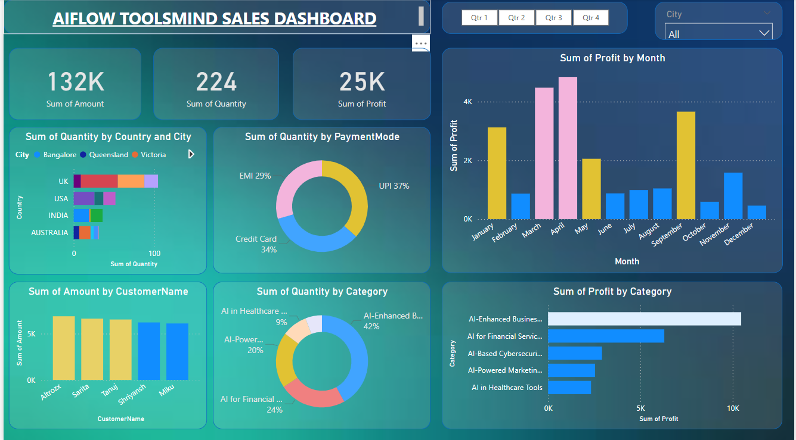

# AIFLOW-TOLLSMIND
AIFLOW TOOLSMIND is a interactive UI/UX sales dashboard that tells about different critereia of sales very easuly and efficently
# 🧠 AIFlow Toolsmind - Sales Dashboard (Power BI)

This repository contains a Power BI dashboard that provides an interactive and insightful view into the sales performance of **AIFlow Toolsmind**, a software product-based company. The dashboard is designed to help stakeholders make data-driven decisions based on sales trends, customer behavior, and regional performance.

## 📊 Dashboard Features

This Power BI dashboard includes the following key insights:

- 🔝 **Top-Selling Software Products** – Identify which software products are generating the highest revenue.
- 🌍 **Country-wise Demand** – Visual representation of countries with the highest sales and demand.
- 👤 **Top Purchasing Customers** – Discover the individuals or organizations with the most frequent or highest-value purchases.
- 📈 **Sales Trends** – Analyze how sales vary over time (monthly/quarterly).
- 🧩 **Dynamic Filters & Visuals** – Interact with slicers and filters to explore sales from different perspectives.

## 📁 Project Files

- `AIFlow_Sales_Dashboard.pbix` – The main Power BI dashboard file.
- `images/` – Folder containing preview screenshots of the dashboard.
- `data/`– Sample or dummy data used for the dashboard .
- `README.md` – This file.

## 🖼️ Dashboard Preview

  
  

## 🚀 Getting Started

To view or edit the dashboard:

1. Download the `.pbix` file from this repository.
2. Open it using [Power BI Desktop](https://powerbi.microsoft.com/desktop/).
3. Explore the visuals and interact with filters as needed.

## ⚠️ Disclaimer

- The data used in this dashboard is **dummy/mock data** .
- Do not use this dashboard for real business decisions unless based on verified company data.

## 📬 Contact

For questions or collaboration opportunities:

---

